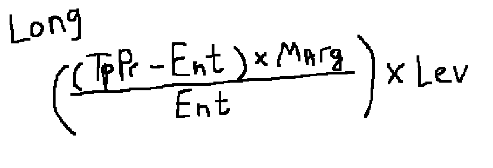

# DyweApp Docs

### Components & Pages

- Все компоненты храняться в папке components. Туда выносяться переиспользуемые комопненты, разделяемые на блоки. `(Для панели управления сделками создаётся отдельная папка /PositionControl и в ней создаются все локальные компоненты для данной панели)`
- Если компонент глобальный `(Header, Footer, ModalWindow)`, то под него создаётся одноименная папка.
- Для группы компонентов `(в основном это кнопки)`, создаётся отдельная папка и туда добавляются все кнопки. Каждая лежит в своей подпапке.

### Styles

- Все глобальные стили `(buttons, colors, fonts, mixins, reset, etc.)` лежат в папке [globalStyles]('./src/app/globalStyles/')
- Для наименования кнопок используется формат записи `button-{тип кнопки}`. К примеру для кнопки подключения кошелька используется `button-connect`
- Все шрифты из макета были перенесены. Чтобы присвоить тексту нужный шрифт, используется формать записи `N-nn` или `N-Wnn`, где
  - `N - первая буквы-две наименования шрифтовой пары (Montserrat - M, OpenSans - OS)`
  - `w - буква начертания. (отсутствие буквы - regular, m - medium, b - bold)`
  - `nn - числовое значение font-size`

### Global Components

#### [Header]('./src/app/components/header/');

Компонент шапки, которая будет использовать на всех страницах.

#### [Buttons]('./src/app/components/buttons/');

- [Button-connect]('./src/app/components/buttons/button-connect/')
  Компонент кнопки подключения, который использует в шапке. Так же будет использовать в блоке с информацией о позициях и ордерах.
- [Button-connect-main]('./src/app/components/buttons/button-connect-main/')
  Компонент кнопки подключения, который использует в [Position-control]('./src/app/components/position-control/')
- [Button-part]('./src/app/components/buttons/button-part/')
  Компонент кнопки контроля. Используется в [Position-control]('./src/app/components/position-control/')
- [Button-position]('./src/app/components/buttons/button-position/')
  Компонент кнопки открытия позиции. Используется в [Position-control]('./src/app/components/position-control/')
- [Button-wallet]('./src/app/components/buttons/button-w/')
  Компонент кнопки контроля кошелька. Используется в [Header]('./src/app/components/header/')
- [Button-custom]('./src/app/components/buttons/button-custom/')
  Компонент обычной кнопки. В качестве параметров принимаеи `text, colorClass, dissabled`

#### [Input]('./src/app/components/input/');

Компонент основного инпута.

#### [Messages]('./src/app/components/messages/');

- [Error-message]('./src/app/components/messages/error-message/')
  Компонент сообщения об ошибке. Использует в [Position-control]('./src/app/components/position-control/')

#### [Modals]('./src/app/components/modal/');

- [Mini-modal]('./src/app/components/modal/mini-modal/')
  Компонент маленького модального окна, для незначительных push-уведомлений. Использует при копировании адресса кошелька, через [Button-wallet]('./src/app/components/buttons/button-w/')

- [Confirmation-modal]('./src/app/components/modal/confirmation-modal/')
  Компонент модального окна для подтверждения действия (закрытие позиции, отмена ордера и прочее).

- [Edit-order-modal]('./src/app/components/modal/edit-order-modal/')
  Компонент модального окна для изменения ордера.

- [Edit-pos-modal]('./src/app/components/modal/edit-pos-modal/')
  Компонент модального окна для изменения открытой позиции.

#### [Switcher-sections]('./src/app/components/switcher-section/')

Компонент для создания меню-переключателей. Используется в [positions-orders]('./src/app/components/positions-orders/') & [search-pair]('./src/app/components/trade-pair-info/search-pair/')
В качестве пропсов принимает

- `sections: {id: string, name: string}[]`
- `activeSection: string`
- `updateActiveSection: EventEmmiter<string>`

Пример

```ts
  public sections: { id: string; name: string }[] = [
    {
      id: 'favorites',
      name: 'Favorites',
    },
  ];
  public activeSection: string = 'all';

  public toggleSection(section: string) {
    this.activeSection = section;
  }

  <switcher-section
    [sections]="sections"
    [activeSection]="activeSection"
    (updateActiveSection)="toggleSection($event)"
  />
```

#### [Positions-Orders]('./src/app/components/positions-orders/')

Компонент предоставляет собой часть интерфейса отвечающую за отображение секций Open position, Position History, Open Orders, Orders History.

##### [PO-items]('./src/app/components/positions-orders/po-items/')

Папка хранит все компоненns itemo-в (Open/History), а так же дополнительные компоненты.

- [Type-Badge]('./src/app/components/positions-orders/po-items/type-badge/') | Компонент отвечающий за бейдж позиции. В качестве параметров принимает `positionType` с `string` значением. Поддерживает только Long, Short.

```ts
<type-badge positionType="Long">
```

- [PO-button]('./src/app/components/positions-orders/po-items/po-button/') | Компонент отвечающий за кнопки контроля. В качестве параметров принимает `buttonType` с `string` значением. Поддерживает только Edit, Close.

```ts
<po-button buttonType="Edit">
```

- [PO-metrics]('./src/app/components/positions-orders/po-items/po-metrics/') | Папка хранящая компоненты метриков для каждого типа [po-item]('./src/app/components/positions-orders/po-items')

#### [Metric Blocks]('./src/app/components/metric-blocks/')

- [Metric Block]('./src/app/components/metric-blocks/metric-block/') | Компонент для обыного блока с метриками. В качестве параметров принимает `title, value, percentage, colorClass` , а так же дополнительный `isMinMaxSplit` (нужен для специфического блока, его можно не указывать).

`percentage` - используем если надо добавить процентны для указаного значения в value. Или же для приблизительного значения в долларах.

`colorClass` - используем если надо добавить специфический цвет. К примеру в Unrealized P&L надо окрашивать текущее значение либо в main, либо в wrong, вот в colorClass будет передавать нужное значение. Для других случаев можно не указывать. Важно! Применяется только к value и percentage.

Пример использования:

```ts
<metric-block [title]="'Entry Price'" [value]="'9.96 TON'">
```

### Services

- [WalletService]('./src/app/services/walletService') - тут хранится информация о кошельке пользователя и вся основная логика (Подключение, Отключение, Получение информации и прочее). Выступает как глобальное хранилище данных о кошельке для всего приложения

- [LanguageService]('./src/app/services/language') - такой же подход используется для языка сайта (в файле лежит логика получения и изменения языка, в будущем добавиться логика функционального изменения языка)

### Utils

В [utils]('./src/app/utils/') будут лежать функции которые выполняют специфические функции в приложении

#### [Utils.service]('./src/app/utils/utils.service.ts')

- `calculateTakeProfitPercent(position, newTakeProfitPercent)` - получает объект позиции и новое значение Take Profit (проценты). Исходя из процентов расчитывает фактическую цену исполнения Take Profit. Записывает в объект позици и возврщает цену и состояния ошибок.
- `calculateStopLossPercent(position, newStopLossPercent)` - получает объект позиции и новое значение Stop Loss (проценты). Исходя из процентов расчитывает фактическую цену исполнения Stop Loss. Записывает в объект позици и возврщает цену и состояния ошибок.
- `calculateTakeProfitPrice(position, newTakeProfitPrice)` - получает объект позиции и новое значение Take Profit (цена). Исходя из цены расчитывает процентный эквивалент исполнения Take Profit. Записывает в объект позици и возврщает цену и состояния ошибок.
- `calculateStopLossPrice(position, newStopLossPrice)` - получает объект позиции и новое значение Stop Loss (цена). Исходя из цены расчитывает процентный эквивалент исполнения Stop Loss. Записывает в объект позици и возврщает цену и состояния ошибок.
- `calculateTakeProfitAmount(position)` - получает объект позиции. Исходя из данных позиции, расчитывает количество средств, которые получит пользователь в случае успешного исполнения Take Profit.
- `calculateStopLossAmount(position)` - получает объект позиции. Исходя из данных позиции, расчитывает количество средств, которые потеряет пользователь в случае успешного исполнения Stop Loss.
- `calculatePositionFees(position)` - получает объект позиции. Исходя из данных позиции, расчитывает комиссионые сборы за открытие позиции.
- `calculateLiquidationPrice(position)` - получает объект позиции. Исходя из данных позиции, расчитывает цену ликвидации позиции.
- `calculatePositionSize(position)` - получает объект позиции. Исходя из данных позиции, расчитывает объём позиции с плечом.

### Interfaces

#### [Position.interface]('./src/app/interfaces/position.ts')

```ts
export interface Position {
  PositionType: string; (Long, Short)
  PriceType: string; (Market, Limit)
  EntryPrice: number;
  Margin: number;
  Amount: number;
  Leverage: number;
  PositionSize: number;
  TakeProfit?: number; (optional)
  StopLoss?: number; (optional)
  TakeProfitPercent?: number; (optional)
  StopLossPercent?: number; (optional)
  TakeProfitAmount?: number; (optional)
  StopLossAmount?: number; (optional)
  Liquidation: number;
  Commission: number; (процент комиссии за открытие/закрытие позиции)
  Fees: number;
}
```

### Libraries

- [tonconnect-ui-angular-fork]('https://www.npmjs.com/package/tonconnect-ui-angular-fork')
- [currency.js]('https://www.npmjs.com/package/currency.js')

### Pipes

- [Short-address]('./src/app/pipes/short-address.pipe.ts') Пайп для сокращения адреса кошелька (UQWA...AWQU)

### Formulas

### Take Profit

#### Percent -> Price:

Входные параметры:</br>
`EntryPrice` </br>
`TakeProfitPercent`</br>
`Leverage`</br>

- Long
  - EntryPrice + ((EntryPrice \* TakeProfitPercent) / 100 / Leverage)
    
- Short
  - EntryPrice - ((EntryPrice \* TakeProfitPercent) / 100 / Leverage)
    

#### Price -> Percent:

Входные параметры:</br>
`EntryPrice` </br>
`TakeProfitPrice`</br>
`Leverage`</br>

- Long
  - ((TakeProfitPrice - EntryPrice) _ 100 _ Leverage) / EntryPrice
    
- Short
  - ((EntryPrice - TakeProfitPrice) _ 100 _ Leverage) / EntryPrice
    

#### Amount

Входные параметры:</br>
`EntryPrice` </br>
`TakeProfitPrice` </br>
`Margin`</br>
`Leverage`</br>
`Commission`</br>

- Long
  - Total Amount: ( (TakeProfitPrice - EntryPrice) \* Margin / Entry Price) \* Leverage
    
  - Final Profit: TotalAmount \* (1 - Commission)
    
- Short
  - Total Amount: ( (EntryPrice - TakeProfitPrice) \* Margin / Entry Price) \* Leverage
    
  - Final Profit: TotalAmount \* (1 - Commission)
    

### Stop Loss

#### Percent -> Price

Входные параметры:</br>
`EntryPrice` </br>
`StopLossPercent`</br>
`Leverage`</br>

- Long
  - EntryPrice - (EntryPrice \* StopLossPercent / 100 / Leverage)
    
- Short
  - EntryPrice + (EntryPrice \* StopLossPercent / 100 / Leverage)
    

#### Price -> Percent

Входные параметры:</br>
`EntryPrice` </br>
`StopLossPrice`</br>
`Leverage`</br>

- Long
  - ((EntryPrice - StopLossPrice) \* 100 \* Leverage) / EntryPrice
    
- Short
  - ((StopLossPrice - EntryPrice) \* 100 \* Leverage) / EntryPrice
    

#### Amount

Входные параметры:</br>
`EntryPrice` </br>
`StopLossPrice`</br>
`Position Size`</br>
`Commission`</br>

- Long
  - LossPerPosition = EntryPrice - StopLossPrice
  - TotalStopLoss = LossPerPosition \* (PositionSize / EntryPrice)
    
  - CommissionPos = PositionSize \* (Commission / 100)
  - FinalStopLoss = TotalStopLoss - CommissionPos;
    
- Short
  - LossPerPosition = StopLossPrice - EntryPrice
  - TotalStopLoss = LossPerPosition \* (PositionSize / EntryPrice)
    
  - CommissionPos = PositionSize \* (Commission / 100)
  - FinalStopLoss = TotalStopLoss - CommissionPos;
    

### Liquidation

Входные параметры:</br>
`EntryPrice` </br>
`PositionSize` </br>
`MaintenanceMarginRate` </br>
`MaintenanceMargin` </br>
`Margin`</br>
`Leverage`</br>
`Commission`</br>

- MaintenanceMargin = PositionSize \* MaintenanceMarginRate

- Long
  - EntryPrice - ((Margin - MaintenanceMargin) / PositionSize) \* EntryPrice
    
- Short
  - EntryPrice + ((Margin - MaintenanceMargin) / PositionSize) \* EntryPrice
    
